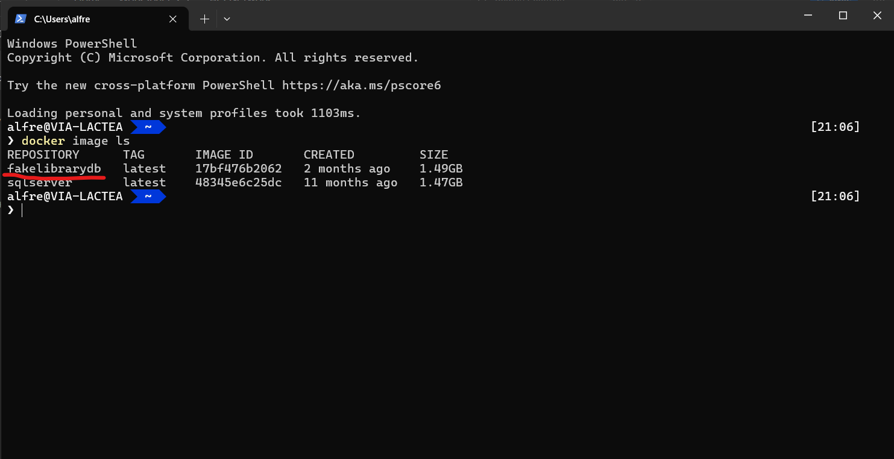
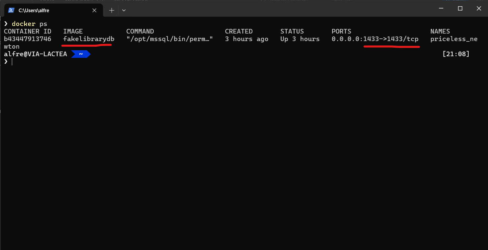
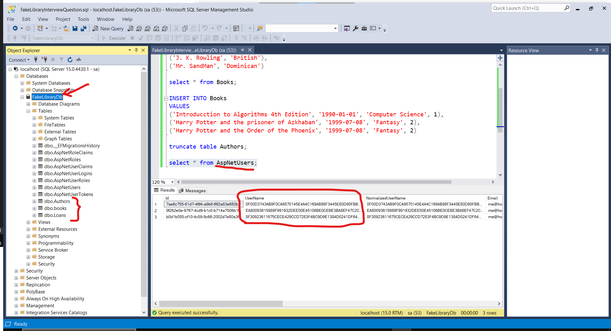
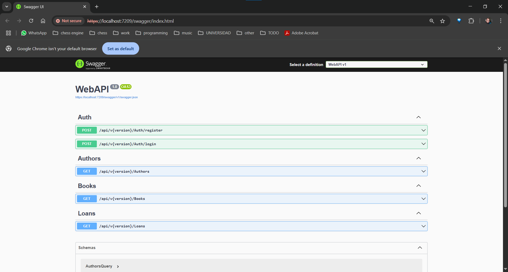
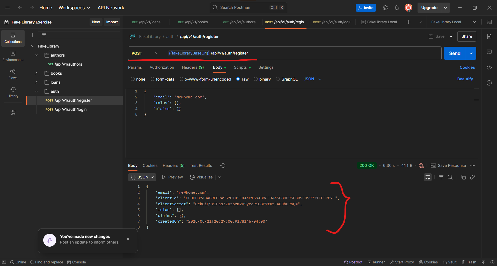
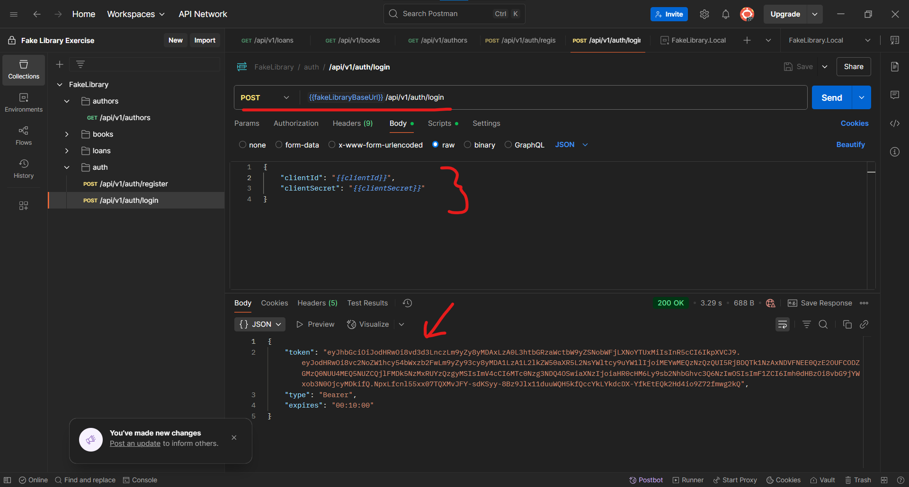
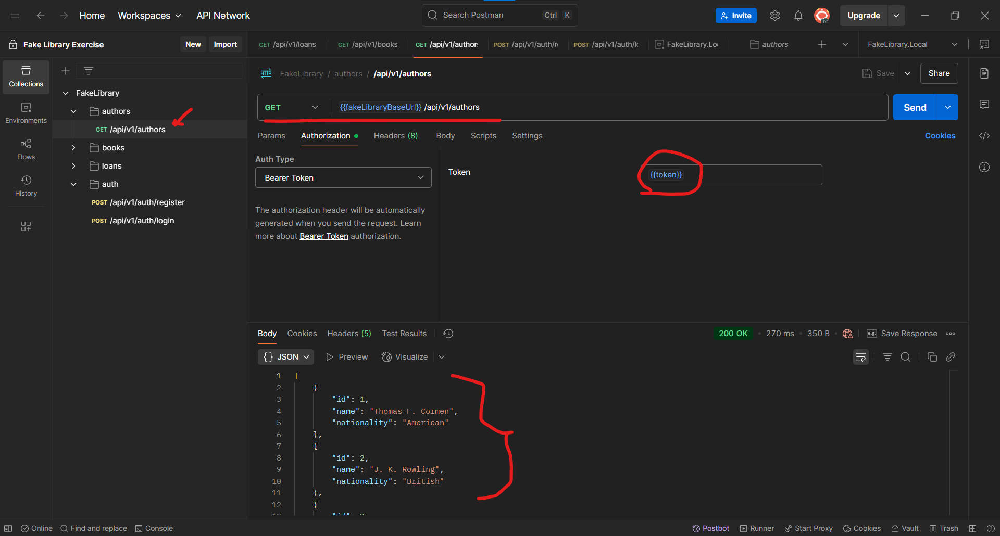
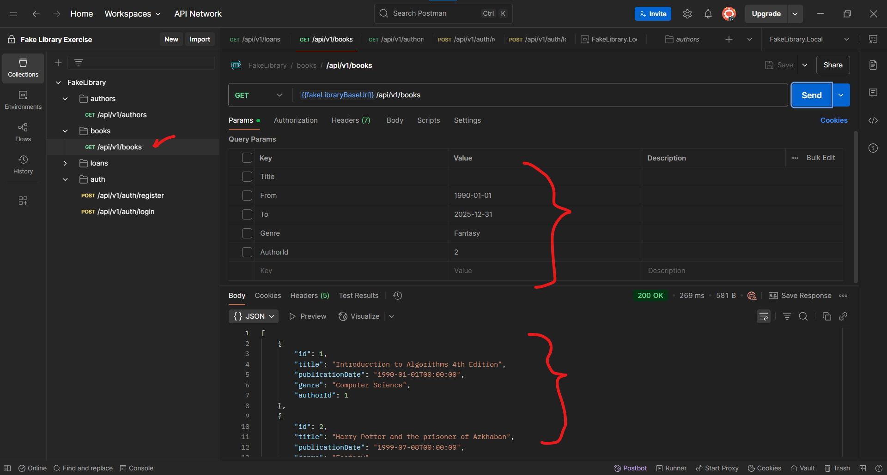

# Fake Library API Exercise

Esta es la solución de la prueba técnica detallada en [definicion del problema](/Resources/Problem/Prueba%20tecnica.pdf).

# Dependencias

- [.NET 8](https://dotnet.microsoft.com/en-us/download/dotnet/8.0)
- [AutoMapper 14.0.0](https://www.nuget.org/packages/automapper/)
- [MediatR 12.5.0](https://www.nuget.org/packages/mediatr/)
- [Microsoft.AspNetCore.Mvc.Versioning 5.1.0](https://www.nuget.org/packages/Microsoft.AspNetCore.Mvc.Versioning)
- [Microsoft.AspNetCore.Authentication.JwtBearer 8.0.16](https://www.nuget.org/packages/Microsoft.AspNetCore.Authentication.JwtBearer/8.0.16)
- [Microsoft.EntityFrameworkCore 8.0.16](https://www.nuget.org/packages/Microsoft.EntityFrameworkCore/8.0.16)
- [Microsoft.AspNetCore.Identity.EntityFrameworkCore 8.0.16](https://www.nuget.org/packages/Microsoft.AspNetCore.Identity.EntityFrameworkCore/8.0.16)
- [Microsoft.EntityFrameworkCore.Design 8.0.16](https://www.nuget.org/packages/Microsoft.EntityFrameworkCore.Design/8.0.16)
- [Microsoft.EntityFrameworkCore.SqlServer 8.0.16](https://www.nuget.org/packages/Microsoft.EntityFrameworkCore.SqlServer/8.0.16)
- [Docker](https://docs.docker.com/get-started/get-docker/)

# Patrones utilizados

- [Clean Architecture](https://www.geeksforgeeks.org/complete-guide-to-clean-architecture/)
- [Unit Of Work](https://learn.microsoft.com/en-us/aspnet/mvc/overview/older-versions/getting-started-with-ef-5-using-mvc-4/implementing-the-repository-and-unit-of-work-patterns-in-an-asp-net-mvc-application)
- [Repository](https://learn.microsoft.com/en-us/aspnet/mvc/overview/older-versions/getting-started-with-ef-5-using-mvc-4/implementing-the-repository-and-unit-of-work-patterns-in-an-asp-net-mvc-application)
- [Mediator](https://refactoring.guru/design-patterns/mediator)
- [Microsoft's Options Pattern](https://learn.microsoft.com/en-us/aspnet/core/fundamentals/configuration/options?view=aspnetcore-9.0)

# Información sobre el build

- Plataforma:
    - Construcción: Windows 10
    - Ejecución (fotos y videos): ~Linux (Ubuntu 22.0.4 LTS)~ Windows 10

- IDE & Tools: Visual Studio, VSCode, SSMS, DBeaver, bash terminal, Postman, docker

# Features adicionales (No estaban en los requerimientos)

- Organizacion de archivos de configuración y publish profiles por ambiente. Necesario para implementar pipelines de CI/CD.
- Versionamiento del API. (v1)
- Algunos endpoints extra para hacer CRUD y facilitar las pruebas manuales.
- Todos los endpoints estan protegidos con jwts.
- Algunos endpoints que requerian que una accion o un filtro en especifico estuviera especificado en la ruta
del endpoint fueron cambiados para que utilizaran filtros como query params apegandose mejor a un estandar REST.

# Build

```bash
dotnet build
```

# Run

## Spin Database Docker Container

Build Image:

```bash
docker build -f ./DatabaseDockerfile -t fakelibrarydb .
```

Start Container:

```bash
docker run -p 1433:1433 fakelibrarydb
```

Apply migrations to database (pick corresponding environment)

```bash

cd WebAPI

dotnet ef database update -- --environment Local
```

Seed Data:

Ejecutar el script [seedData.sql](./Resources/Scripts/seedData.sql) con el RDBMS preferido.
Las credenciales por defecto estan en los connection strings dentro de los archivos de configuración [WebAPI](./WebAPI/) o
dentro de [database docker file](./DatabaseDockerfile)

**Como la base de datos se genero y se diseño usando "Code First" es muy incomodo probar la diferencia en el performance al remover y restaurar indices**

**Si desea saber cual es el schema exacto y contraints generados se puede utilizar el siguiente comando para generar un script idempotente**

```bash

cd WebAPI

dotnet ef migrations script --project ../Data --output ../MigrationScript.sql --idempotent
```

Dicho [script](./MigrationScript.sql) ha sido incluido en repo para que pueda ser examinado.

## Run Web API

```bash
dotnet run --project .\WebAPI\WebAPI.csproj -- --environment Local
```

Especificando el ambiente deseado.

Los postman collections con todos los endpoints y requests estan [aquí](./Resources/Postman/).

# ScreenShots (Proceso de Contrucción)

















# Youtube Video

[Short Overview](https://www.youtube.com/watch?v=n3zVyaEjWBc)

Inicialmente iba a grabar el demo usando Ubuntu para mostrar que la solución
es multiplataforma pero no me alcanzó el tiempo.

Perdón por la calidad y la falta de detalle en el video pero estaba pasando
dificultades técnicas con el software que tenía para grabar la pantalla.

